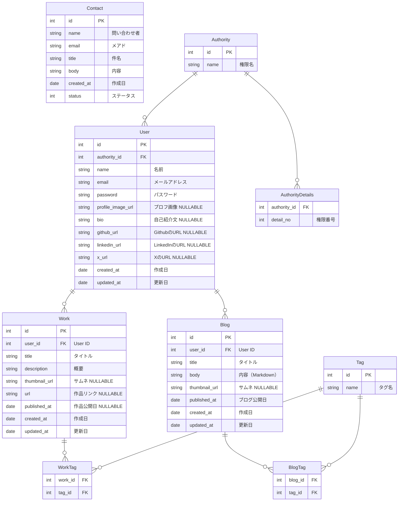

# ER図

```mermaid
erDiagram
    User {
        int id PK
        int authority_id FK
        string name  "名前"
        string email "メールアドレス"
        string password "パスワード"
        string profile_image_url "プロフ画像 NULLABLE"
        string bio "自己紹介文 NULLABLE"
        string github_url "GithubのURL NULLABLE"
        string linkedin_url "LinkedInのURL NULLABLE"
        string x_url "XのURL NULLABLE"
        date created_at "作成日"
        date updated_at "更新日"
    }

    Work {
        int id PK
        int user_id FK "User ID"
        string title "タイトル"
        string description "概要"
        string thumbnail_url "サムネ NULLABLE"
        string url "作品リンク NULLABLE"
        date published_at "作品公開日 NULLABLE"
        date created_at "作成日"
        date updated_at "更新日"
    }

    Blog {
        int id PK
        int user_id FK "User ID"
        string title "タイトル"
        string body "内容（Markdown）"
        string thumbnail_url "サムネ NULLABLE"
        date published_at "ブログ公開日"
        date created_at "作成日"
        date updated_at "更新日"
    }

    Tag {
        int id PK
        string name "タグ名"
    }

    BlogTag {
        int blog_id FK
        int tag_id FK
    }

    WorkTag {
        int work_id FK
        int tag_id FK
    }

    Contact {
        int id PK
        string name "問い合わせ者"
        string email "メアド"
        string title "件名"
        string body "内容"
        date created_at "作成日"
        int status "ステータス"
    }

    Authority {
        int id PK
        string name "権限名"
    }

    AuthorityDetails {
        int authority_id FK
        int detail_no "権限番号"
    }

    User ||--o{ Work: ""
    User ||--o{ Blog : ""
    Work ||--o{ WorkTag : ""
    Blog ||--o{ BlogTag : ""
    Tag ||--o{ BlogTag : ""
    Tag ||--o{ WorkTag : ""
    Authority ||--o{ AuthorityDetails : ""
    Authority ||--o{ User : ""
```
